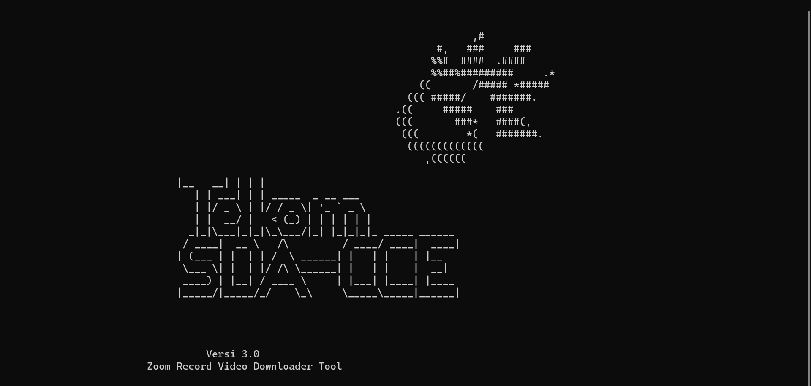

# Zoom Downloader

[](https://www.python.org/) [](https://raw.githubusercontent.com/ricardorodrigues-ca/zoom-recording-downloader/master/LICENSE)

**Zoom Downloader** adalah script Python yang menggunakan API Zoom (v2) untuk mengunduh dan mengatur semua rekaman cloud dari akun Zoom ke penyimpanan lokal.

## Screenshot ##


## Installasi ##

_Attention: Install [Python 3.6](https://www.python.org/downloads/) atau lebih tinggi_

```sh
$ git clone https://github.com/kizbudin/Zoom-Downloader.git
$ cd Zoom-Downloader
$ pip3 install -r requirements.txt
```

## Penggunaan ##

_Attention: Untuk menggunakan tools ini, perlu akun [Zoom Developer account](https://marketplace.zoom.us/) untuk membuat [JWT app](https://marketplace.zoom.us/docs/guides/build/jwt-app) dengan menggunakan token anda_

Buat sebuah file bernama **appenv.py** dengan variabel bernama `JWT_TOKEN` isikan variabel tersebut dengan token JWT anda:

    JWT_TOKEN = 'letakkan_JWT Token'

Buka file **zoom-recording-downloader.py** dengan menggunaka text editor seperti notepad, sublime dll. lalu ubah isi dari variabel berikut:

- Set variabel ini ke tanggal perekaman paling awal yang ingin di unduh, dalam periode 6 bulan (default is January 1st, 2021)

      RECORDING_START_YEAR = 2021
      
      RECORDING_START_MONTH = 1
      
      RECORDING_START_DAY = 1

- Tentukan nama folder yagn akan digunakan untuk tempat download video (default = downloads)

      DOWNLOAD_DIRECTORY = 'downloads'

- Tentukan nama file log yang akan menyimpan ID rekaman yang diunduh

      COMPLETED_MEETING_IDS_LOG = 'completed-downloads.log'

Perintah untuk menjalankan program:

```sh
python3 zoom-recording-downloader.py
```
